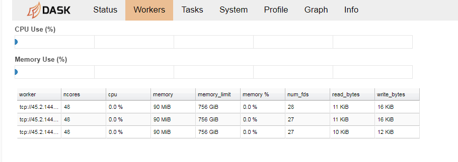

# Distributed hyperparameter search

This notebook is a demonstration of distributed search/optimization of hyperparameters. 
If you had several GPUs available you might have been wondering how can you evaluate your model with different parameters in a distributed fashion without having to couple and highly customize your code to the infrastructure. 

The parameters you are looking for can be anything from learning rate to number of layers or channels in certain layers. 
Evaluating your model with different parameters may give you a better understanding on the performance of the model and how certain parameters affect your objectives.

In this notebook we will use dask for distributing evaluations and a bayesian optimization loop to search for hyperparameters. 

# Dask

Dask is a library that provides capabilities to scale up your operations, and execute them parallel on a cluster. We will set up a scheduler and create several workers with different resources avaiable.

**1. Start a dask scheduler**

After installing __[dask](http://docs.dask.org/en/latest/install.html)__ run the command below. This will start up a scheduler 
```
dask-scheduler
```

This will output the url of the scheduler where you need to register workers. Copy the url of the register and register several worker with different GPUs.

**2. Register workers to the dask scheduler**

```
CUDA_VISIBLE_DEVICES=0 dask-worker tcp://45.2.144.197:8786
CUDA_VISIBLE_DEVICES=1 dask-worker tcp://45.2.144.197:8786
CUDA_VISIBLE_DEVICES=2 dask-worker tcp://45.2.144.197:8786
```

CUDA_VISIBLE_DEVICES will set the available GPU for the given workers. Once the workers are registered you can monitor them using the bokeh. The url of the bokeh is output when you started the scheduler.



Now we have three workers available each of them with a dedicated GPU. Time to fire up our optimizer.

# Skopt


```python
import skopt
from skopt import gp_minimize
from skopt.space import Real, Categorical, Integer
from skopt.utils import use_named_args
from skopt import Optimizer
from skopt.learning import GaussianProcessRegressor
from skopt.space import Real
```

Skopt provides an optimization interface that runs a Bayesian optimization loop underneath. The 'ask and tell' api of Skopt at each evaluation cycle gives a set of hyperparameters that will likely to perform better based on previous observations. For more information see __[Ask and Tell](https://scikit-optimize.github.io/notebooks/ask-and-tell.html)__

The steps are the following:
0. You define the ranges of the parameters you are looking for
1. You **ask** for x(number of workers) sets of hyperparameters
2. Evaluate the performance of your model using the hyperparameters on the workers
3. **Tell** the optimizer the results of the evaluations
4. Repeat the process from 1

**1. Define the ranges of parameters**

##### Learning rate


```python
lr_rate_range = Real(low=float(1e-6), high=float(1e+1), prior='log-uniform', name = 'learning_rate')
```

##### Keep prob


```python
keep_prob_range = Real(low=0.1, high=1.0, prior='log-uniform', name = 'keep_prob')
```

##### Channel range


```python
channel_range = Integer(low=3, high=7, name='channel')
```

##### Pool range


```python
pool_range = Categorical(categories=['max', 'avg'], name='pool')
```


```python
dimensions = [lr_rate_range, keep_prob_range, channel_range, pool_range]
```

#### Evaluation function
Define your evaluation function. In case a deep learning model you can use a number of epoch to see how your model performs. Of course you have to take into consideration certain parameters may impact your loss in fixed amount of epochs but may perform better if you train your network longer..

```python
def evaluate_parameters(learning_rate, keep_prob, channel, pool):
    #Evaluate your model for a few epochs and return loss value
    print("Lr {} kp {} channel {} pool {}".format(learning_rate, keep_prob, channel, pool))
    loss = 0.4
    return loss
```

##### Create an optimizer


```python
optimizer = Optimizer(dimensions=dimensions)
```

##### Register scheduler and kick off optimizer


```python
from distributed.joblib import DistributedBackend 
from sklearn.externals.joblib import Parallel, parallel_backend, register_parallel_backend
```


```python
NO_OF_WORKERS = 3
SCHEDULER_URL = 'tcp://45.2.144.197:8786' ## url of the scheduler
iterations = 1000
```


```python
register_parallel_backend('distributed', DistributedBackend)
with parallel_backend('distributed', scheduler_host=SCHEDULER_URL):
    for i in tqdm(range(0,iterations)):
        x = optimizer.ask(n_points=NO_OF_WORKERS)
        y = Parallel()(delayed(evaluate_parameters)(float(p[0]),float(p[1]),int(p[2]),p[3]) for p in x)
        optimizer.tell(x, y)
```

This will evaluate NO_OF_WORKERS sets of parameters in parallel and when finished tells the optimizer the result and ask for the next sets of parameters. It is important to note that if runtime depends on the values of the hyperparamers, this is not efficient, as workers that finish earlier will be blocked

##### [Visualise your results](https://scikit-optimize.github.io/notebooks/visualizing-results.html)
